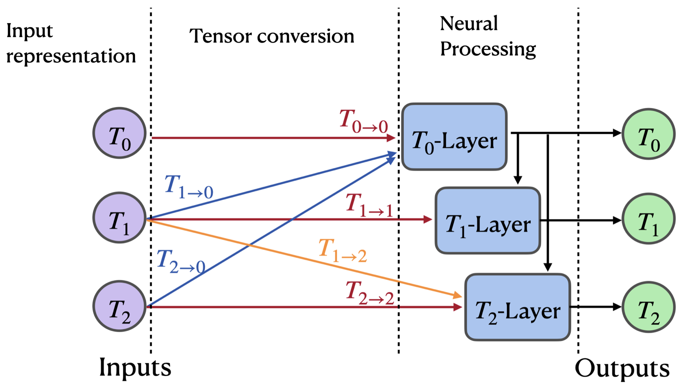

<!--
Copyright (C) 2025 Mitsubishi Electric Research Laboratories (MERL)

SPDX-License-Identifier: AGPL-3.0-or-later
-->

# G-RepsNets (TMLR 2025)

This repository contains the implementation of the paper:
> **G-RepsNets: A Fast and General Construction of Equivariant Networks for Arbitrary Matrix Groups**<br>
> [Sourya Basu](https://basusourya.github.io/), [Suhas Lohit](https://www.merl.com/people/slohit), [Matthew Brand](https://www.merl.com/people/brand)

Transactions on Machine Learning Research (TMLR), 2025

## Summary

Group equivariance is a strong inductive bias useful in a wide range of deep learning tasks. However, constructing efficient equivariant networks for general groups and domains is difficult. Recent work on equivariant multi-layer perceptrons (EMLPs) by Finzi et al. directly solves the equivariance constraint for arbitrary matrix groups to obtain EMLPs, but this method does not scale well, and scaling is crucial in deep learning. Here, we introduce Group Representation Networks (G-RepsNets), a lightweight equivariant network for arbitrary matrix groups with features represented using tensor polynomials. The key insight in our design is that using tensor representations in the hidden layers of a neural network along with simple inexpensive tensor operations leads to scalable equivariant networks. Further, these networks are universal approximators of functions equivariant to orthogonal groups. We find G-RepsNet to be competitive to EMLP on several tasks with group symmetries such as $O(5)$, $O(1, 3)$, and $O(3)$ with scalars, vectors, and second-order tensors as data types. On image classification tasks, we find that G-RepsNet using second-order representations is competitive and often even outperforms sophisticated state-of-the-art equivariant models such as Group Convolutional Neural Networks (GCNNs) and $E(2)$-CNNs. To further illustrate the generality of our approach, we show that G-RepsNet is competitive to Group-Fourier Neural Operators and Equivariant Graph Neural Networks on N-body predictions and solving PDEs respectively, while being efficient.

<div align=center></div>

## Installation
----
1. First create a conda environment using `conda create --name grepsnet python=3.8`.
2. Activate the conda environment using `conda activate grepsnet`.
3. Then use `pip install -r requirements.txt` to install the remaining dependencies.


## Training and testing G-RepsNets
----
We have provided the G-RepsNet model definitions, training and testing code for the three synthetic tasks we use to compare against MLPs and EMLPs.
1. $O(5)$-invariance: `python o5_invariance.py`
2. $O(3)$-equivariance: `python o3_equivariance.py`
3. $SO(1,3)$-invariance: `python so13_invariance.py`

## Contributing

See [CONTRIBUTING.md](CONTRIBUTING.md) for our policy on contributions.

## License

Released under `AGPL-3.0-or-later` license, as found in the [LICENSE.md](LICENSE.md) file.

All files, except as noted below:
```
Copyright (c) 2025 Mitsubishi Electric Research Laboratories (MERL)

SPDX-License-Identifier: AGPL-3.0-or-later
```

The dataset definitions in

* `models/o5_invariance.py`
* `models/o3_equivariance.py`
* `models/so13_invariance.py`

were adapted from [EMLP](https://github.com/mfinzi/equivariant-MLP/) (license included in [LICENSES/MIT.txt](LICENSES/MIT.txt)):

```
Copyright (c) 2025 Mitsubishi Electric Research Laboratories (MERL)
Copyright (c) 2021 mfinzi

SPDX-License-Identifier: AGPL-3.0-or-later
SPDX-License-Identifier: MIT
```

## Citation
If you use our work, please use the following citation


```bibTex
@inproceedings{basu2025grepsnet,
  title={G-RepsNet: A Fast and General Construction of Equivariant Networks for Arbitrary Matrix Groups},
  author={Basu, Sourya and Lohit, Suhas and Brand, Matthew},
  booktitle={Transactions on Machine Learning Research},
  year={2025}
}
```
